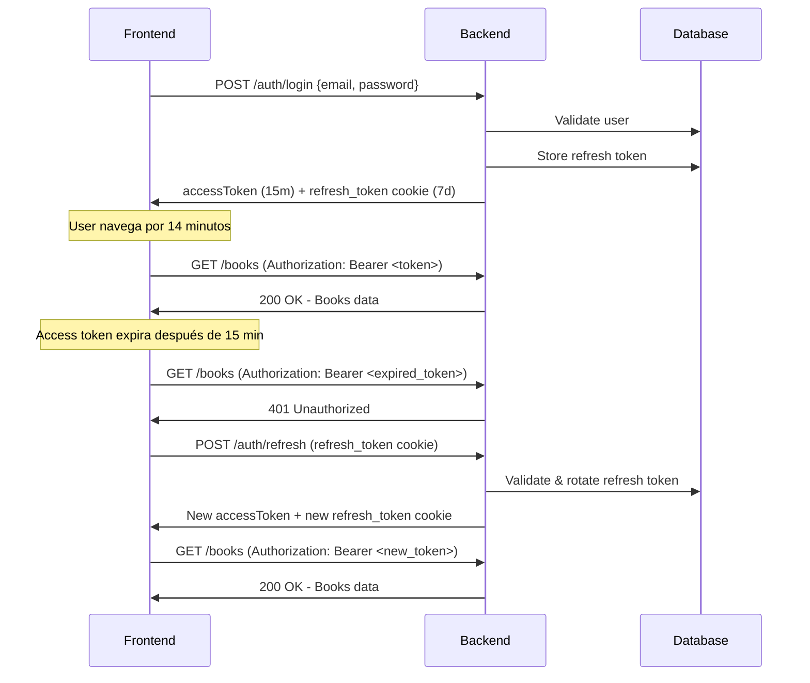

# Migración a Refresh Token Strategy

## 🎯 Cambios realizados

Se ha implementado una estrategia de **refresh tokens** para mejorar la seguridad y la experiencia de usuario:

### Backend

1. **Access Token (corta duración)**
   - Se envía en cada request mediante `Authorization: Bearer <token>` header
   - Duración: 15 minutos (configurable)
   - No se almacena en base de datos
   - **Es un JWT firmado**

2. **Refresh Token (larga duración)**
   - Se envía automáticamente en cookie `httpOnly`
   - Duración: 7 días (configurable)
   - Se almacena en base de datos para poder revocarlo
   - Implementa **rotación**: cada uso genera un nuevo refresh token
   - **Es un token opaco** (string aleatorio de 128 caracteres), NO un JWT

#### ¿Por qué tokens opacos y no JWTs para refresh tokens?

Los refresh tokens usan **tokens opacos** (random strings) en lugar de JWTs por seguridad:

✅ **Revocación real**: Puedes invalidar tokens en DB inmediatamente  
✅ **Auditoría completa**: Historial de creación, uso y revocación  
✅ **Estado en servidor**: No depende solo de firma criptográfica  
✅ **Rotación segura**: Detecta reutilización de tokens robados  

Los access tokens SÍ son JWTs porque:
- ✅ Duración corta (menor riesgo)
- ✅ Stateless (no requiere lookup en DB en cada request)
- ✅ Contienen claims (id, role) para autorización

### Nuevos endpoints

- **POST `/auth/login`**
  - Devuelve: `{ accessToken }` en body + `refresh_token` en cookie httpOnly
  
- **POST `/auth/refresh`**
  - Requiere: `refresh_token` cookie
  - Devuelve: nuevo `{ accessToken }` en body + nuevo `refresh_token` en cookie
  
- **POST `/auth/logout`**
  - Elimina refresh token de la base de datos y limpia la cookie

- **POST `/auth/logout-all`** (requiere autenticación)
  - Revoca TODOS los refresh tokens del usuario (logout desde todos los dispositivos)
  - Útil para cambio de contraseña o sospecha de compromiso de cuenta

---

## 🔐 Revocación de Tokens (Token Revocation)

### ¿Por qué `isActive` en lugar de eliminar?

El sistema usa un campo `isActive` para revocar tokens en lugar de eliminarlos:

**Ventajas:**
- ✅ **Auditoría**: Mantienes historial de cuándo y qué tokens fueron revocados
- ✅ **Seguridad**: Puedes detectar patrones de uso sospechoso
- ✅ **Compliance**: Cumple con regulaciones que requieren logs de acceso
- ✅ **Debugging**: Facilita investigar problemas de autenticación

### Estructura de un Refresh Token en DB:

```typescript
{
  _id: ObjectId,
  token: string,          // Token opaco (128 caracteres hex)
  userId: string,         // ID del usuario propietario
  expiresAt: Date,        // Fecha de expiración natural
  createdAt: Date,        // Fecha de creación
  isActive: boolean,      // false = revocado
  revokedAt: Date | null  // Timestamp de revocación (auditoría)
}
```

### ¿Cómo revocar el acceso de un usuario?

#### 1. Logout desde dispositivo actual (soft revocation)
```bash
POST /auth/logout
Cookie: refresh_token=...

# Revoca solo el token actual
# isActive: false, revokedAt: now()
```

#### 2. Logout desde todos los dispositivos (hard revocation)
```bash
POST /auth/logout-all
Authorization: Bearer <access_token>

# Revoca TODOS los tokens activos del usuario
# UPDATE { userId, isActive: true } SET { isActive: false, revokedAt: now() }
```

#### 3. Revocación manual (administrador o script)
```typescript
import refreshTokensDao from './resources/auth/refresh-tokens.dao.js'

// Revocar todos los tokens de un usuario específico
await refreshTokensDao.revokeByUserId('user-id-here')

// Revocar un token específico
await refreshTokensDao.revokeByToken('token-string-here')
```

### Limpieza automática de tokens

#### Tokens expirados: Limpieza automática con TTL Index

**MongoDB elimina automáticamente** los tokens cuando expiran mediante un **índice TTL** (Time To Live):

```typescript
// Configurado automáticamente al iniciar la app
collection.createIndex({ expiresAt: 1 }, { expireAfterSeconds: 0 })
```

**Cómo funciona:**
- ✅ MongoDB ejecuta una tarea de limpieza **cada 60 segundos**
- ✅ Elimina documentos donde `expiresAt < now()`
- ✅ **Totalmente automático**, no requiere scripts ni cron jobs
- ✅ Muy eficiente y nativo de MongoDB

**Ejemplo:**
```javascript
// Token creado en login
{
  expiresAt: ISODate("2026-04-07T10:00:00Z")  // 7 días desde ahora
}

// MongoDB lo elimina automáticamente después del 7 de abril
```

#### Tokens revocados: Limpieza manual (opcional)

Los tokens **revocados** (logout) se mantienen para auditoría. Opcionalmente puedes limpiar los antiguos:

```bash
# Ejecutar manualmente (elimina revocados > 30 días)
npm run cleanup-tokens

# O configurar como cron job (diario a las 2 AM)
0 2 * * * cd /app && npm run cleanup-tokens
```

**Configuración:**
```env
TOKEN_CLEANUP_DAYS=30  # Eliminar tokens revocados/expirados > 30 días
```

**Script:** [src/scripts/cleanup-tokens.ts](src/scripts/cleanup-tokens.ts)

---

## ⚙️ Variables de entorno

### Nuevas variables requeridas:

```env
# Access Token (JWT de corta duración)
JWT_ACCESS_TOKEN_EXPIRATION=15m      # Formato: 15m, 1h, 24h

# Refresh Token (opaco, NO JWT)
# Nota: Los refresh tokens son strings aleatorios almacenados en DB,
# NO son JWTs firmados. Esto permite revocación real y auditoría.
JWT_REFRESH_TOKEN_EXPIRATION=7d      # Formato: 7d, 30d

# Cookies del Refresh Token
REFRESH_TOKEN_COOKIE_SECURE=false    # true en producción (requiere HTTPS)
REFRESH_TOKEN_COOKIE_SAME_SITE=lax   # strict en producción
```

### Variables obsoletas (eliminar):

```env
# ❌ Ya no se usan:
JWT_EXPIRATION_TIME=600000
ACCESS_TOKEN_COOKIE_SECURE=true
ACCESS_TOKEN_COOKIE_SAME_SITE=
```

### Ejemplo de configuración completa:

#### Desarrollo (HTTP localhost)
```env
ENVIRONMENT=dev
PORT=3000

MONGO_URI=mongodb+srv://your-connection-string

# JWT Configuration
JWT_SECRET=PqwRIJkSJLOQ61n---ld0A
JWT_ACCESS_TOKEN_EXPIRATION=15m
JWT_REFRESH_TOKEN_EXPIRATION=7d

HASH_ROUNDS=10

# Refresh Token Cookies (desarrollo)
REFRESH_TOKEN_COOKIE_SECURE=false
REFRESH_TOKEN_COOKIE_SAME_SITE=lax

CORS_ORIGIN=http://localhost:4200
```

#### Producción (HTTPS)
```env
ENVIRONMENT=production
PORT=3000

MONGO_URI=mongodb+srv://your-production-connection

# JWT Configuration
JWT_SECRET=secure-production-secret
JWT_ACCESS_TOKEN_EXPIRATION=15m
JWT_REFRESH_TOKEN_EXPIRATION=7d

HASH_ROUNDS=12

# Refresh Token Cookies (producción)
REFRESH_TOKEN_COOKIE_SECURE=true
REFRESH_TOKEN_COOKIE_SAME_SITE=strict

CORS_ORIGIN=https://your-domain.com
```

---

## 🔄 Cambios necesarios en el Frontend

### 1. Actualizar el servicio de Login

**Antes:**
```typescript
// El token venía en una cookie y se enviaba automáticamente
login(email: string, password: string) {
  return this.http.post('/auth/login', { email, password })
}
```

**Ahora:**
```typescript
login(email: string, password: string) {
  return this.http.post<{ results: { type: 'auth', attributes: { accessToken: string } } }>(
    '/auth/login', 
    { email, password },
    { withCredentials: true } // Importante para recibir la cookie
  ).pipe(
    map(response => response.results.attributes.accessToken),
    tap(accessToken => this.saveToken(accessToken))
  )
}

private saveToken(token: string) {
  localStorage.setItem('access_token', token)
  // O sessionStorage si prefieres:
  // sessionStorage.setItem('access_token', token)
}
```

### 2. Crear un Interceptor para agregar el token

```typescript
import { HttpInterceptor, HttpRequest, HttpHandler } from '@angular/common/http'
import { Injectable } from '@angular/core'

@Injectable()
export class AuthInterceptor implements HttpInterceptor {
  intercept(req: HttpRequest<any>, next: HttpHandler) {
    const token = localStorage.getItem('access_token')
    
    if (token) {
      req = req.clone({
        setHeaders: {
          Authorization: `Bearer ${token}`
        },
        withCredentials: true // Para enviar cookies (refresh token)
      })
    }
    
    return next.handle(req)
  }
}
```

### 3. Implementar Auto-Refresh cuando el token expira

```typescript
import { HttpInterceptor, HttpRequest, HttpHandler, HttpErrorResponse } from '@angular/common/http'
import { Injectable } from '@angular/core'
import { catchError, switchMap, throwError } from 'rxjs'
import { AuthService } from './auth.service'

@Injectable()
export class TokenRefreshInterceptor implements HttpInterceptor {
  constructor(private authService: AuthService) {}

  intercept(req: HttpRequest<any>, next: HttpHandler) {
    return next.handle(req).pipe(
      catchError((error: HttpErrorResponse) => {
        // Si el token expiró (401 o 403)
        if (error.status === 401 || error.status === 403) {
          return this.authService.refreshToken().pipe(
            switchMap(newToken => {
              // Reintentar el request original con el nuevo token
              const clonedReq = req.clone({
                setHeaders: {
                  Authorization: `Bearer ${newToken}`
                }
              })
              return next.handle(clonedReq)
            }),
            catchError(refreshError => {
              // Si falla el refresh, logout
              this.authService.logout()
              return throwError(() => refreshError)
            })
          )
        }
        
        return throwError(() => error)
      })
    )
  }
}
```

### 4. Implementar el método refreshToken

```typescript
refreshToken() {
  return this.http.post<{ results: { type: 'auth', attributes: { accessToken: string } } }>(
    '/auth/refresh',
    {},
    { withCredentials: true } // Importante: envía la cookie refresh_token
  ).pipe(
    map(response => response.results.attributes.accessToken),
    tap(accessToken => this.saveToken(accessToken))
  )
}
```

### 5. Actualizar el logout

```typescript
logout() {
  return this.http.post('/auth/logout', {}, { withCredentials: true }).pipe(
    tap(() => {
      localStorage.removeItem('access_token')
      // Redirigir a login
    })
  )
}
```

### 6. Registrar los interceptors en tu módulo

```typescript
import { HTTP_INTERCEPTORS } from '@angular/common/http'

@NgModule({
  providers: [
    { provide: HTTP_INTERCEPTORS, useClass: AuthInterceptor, multi: true },
    { provide: HTTP_INTERCEPTORS, useClass: TokenRefreshInterceptor, multi: true }
  ]
})
export class AppModule { }
```

---

## 🔒 Mejoras de Seguridad

1. **XSS Protection**: Refresh token en `httpOnly` cookie → JavaScript no puede accederlo
2. **Token corto**: Access token dura 15 min → menor ventana si es robado
3. **Revocación**: Refresh tokens en DB → logout real eliminando el token
4. **Rotación**: Cada refresh genera nuevo token → detecta robo de tokens
5. **Separación**: Access en header, Refresh en cookie → diferentes vectores de ataque

---

## ✅ Testing

### Probar login:
```bash
curl -X POST http://localhost:3000/auth/login \
  -H "Content-Type: application/json" \
  -d '{"email":"test@example.com","password":"password"}' \
  -c cookies.txt

# Respuesta esperada:
# {
#   "results": {
#     "type": "auth",
#     "attributes": {
#       "accessToken": "eyJhbGc..."
#     }
#   }
# }
# + Cookie refresh_token en cookies.txt
```

### Probar endpoint protegido con access token:
```bash
curl http://localhost:3000/auth/me \
  -H "Authorization: Bearer <ACCESS_TOKEN>"
```

### Probar refresh token:
```bash
curl -X POST http://localhost:3000/auth/refresh \
  -b cookies.txt \
  -c cookies.txt

# Devuelve nuevo accessToken + rota el refresh token
```

### Probar logout:
```bash
curl -X POST http://localhost:3000/auth/logout \
  -b cookies.txt
```

---

## 📊 Flujo completo


